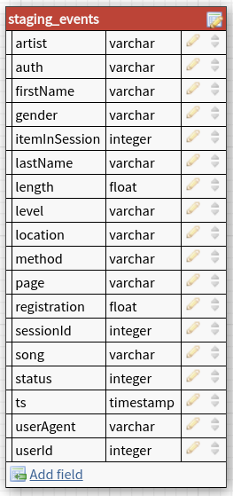
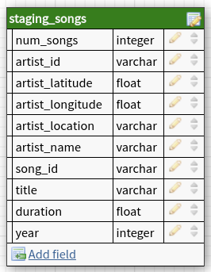

# Sparkify : Your Provider for The World Best Music Library

This repository contains scripts for **E**xtracting music data from AWS S3 bucket and loading them into AWS Redshift staging tables, **T**ransform these data to match the **sparkifydb** database schema, and **L**oad the transformed data into the database final fact and dimension tables.

The two staging tables schemas are represented below :

| staging_events | staging_songs |
|----------------|---------------|
|||

Following is a diagram representing the database schema, with 1 fact table `songplays` and 4 dimension tables `users`, `time`, `songs` and `artists` :


The database design follows a `star schema` to help our analyst team, **The Sparkalysts**, in their mission to answering the questions running through the head of our CEO **The Big Spark** such as :

1. List of songs listened by user `Lily` `Koch` ?
2. In which year did our users listened the most to music ?
3. ...

## Project dataset

We have two datasets stored on S3 buckets :
* song data : json files representing a subset of the **Million Song Dataset**; sample of song file below :
	```json
	{
		"song_id": "SOUYDPQ12A6D4F88E6",
		"num_songs": 1,
		"title": "Tears Of Joy",
		"artist_name": "Wendy & Lisa",
		"artist_latitude": null,
		"year": 1989,
		"duration": 278.46485,
		"artist_id": "ARN4X0U1187B9AFF37",
		"artist_longitude": null,
		"artist_location": ""
	}
	```
* log data : json files representing our users' activities regarding the songs; sample log record :
	```json
		{
			"artist": null,
			"auth": "Logged In",
			"firstName": "Walter",
			"gender": "M",
			"itemInSession": 0,
			"lastName": "Frye",
			"length": null,
			"level": "free",
			"location": "San Francisco-Oakland-Hayward, CA",
			"method": "GET",
			"page": "Home",
			"registration": 1540919166796.0,
			"sessionId": 38,
			"song": null,
			"status": 200,
			"ts": 1541105830796,
			"userAgent": "\"Mozilla/5.0 (Macintosh; Intel Mac OS X 10_9_4) AppleWebKit/537.36 (KHTML, like Gecko) Chrome/36.0.1985.143 Safari/537.36\"",
			"userId": "39"
		}
	```

## Project Structure

The project is structured as follow:

* A script `iac_scripts.py` (Infrastructure As Code) which contains functions for creating/deleting IAM roles and Redshift clusters
* A script `sql_queries.py` which contains all the SQL queries for creating the `sparkifydb`, the different tables, and ETL pipeline.
* A script `create_tables.py` which creates the database and the defined tables
* A script `etl.py` which extracts the data from S3 and transforms the log and song data before loading the processed data into the tables created by the script `create_tables.py`

## Project Setup

To set everything up, there is an extra requirement a configuration file `dwh.cfg` in the project folder located at the same level of other scripts. This file contains the credentials and AWS  for connecting to the database. Following is a sample configuration file content :

```
[CLUSTER]
HOST='your cluster host address'
DWH_CLUSTER_TYPE=multi-node
DWH_NUM_NODES=2
DWH_NODE_TYPE=dc2.large
DWH_CLUSTER_IDENTIFIER=dwhCluster
DB_NAME=sparkifydb
DB_USER=dwhuser
DB_PASSWORD="your very complicated and long passsword"
DB_PORT=5439
REGION='us-west-2'

[IAM_ROLE]
ROLE_NAME=dwhRole
ARN='your iam role arn'

[S3]
LOG_DATA='s3://udacity-dend/log_data'
LOG_JSONPATH='s3://udacity-dend/log_json_path.json'
SONG_DATA='s3://udacity-dend/song_data'

[AWS]
KEY='the key of your IAM user with admin rights'
SECRET='the secret of your IAM user with admin rights'
```

> Note : you'll needto create an IAM user with admin rights if you don't already have one

To set up the project the following steps can be followed in the given order :

* run the following command :
	```sh
	python iac_scripts.py -t create_role
	```
	This will create an IAM Role and save its characteristics in json file `role_arn.json`. You can copy the ARN from the json file in order to fill the config file with right ARN.

* Next, run :
	```sh
	python iac_scripts.py -t create_cluster
	```
	This will create a Redshift cluster. You can adapt the cluster config according to your needs by modifying the config file, more precisely the `[CLUSTER]` section.

* Next, run :
	```sh
	python create_tables.py
	```
  this will connect to the Redshift cluster, drop the tables if they exist and recreate them

* Next run :
	```bash
	python etl.py -t staging
	```
	that will copy the songs and log data from S3 buckets into the two staging tables

* Finally, run :
	```bash
	python etl.py -t analytics
	```
	that will extract data from staging tables and apply the necessary transformations before loading them into the fact and dimension tables.

## Design choice

The for all dimension tables, primary key is used as sort keys as they will be used all the time for joining with fact table.

For the fact table, the `start_time` column is used as distribution key and sort key, as a very frequent query would be to get activities for a given range date, given months, days, ... Also distributing according to this column may give more even balanced distribution across nodes. Other candidate columns for distribution key are `song_id` and `artist_id`, as there might also be frequent to join with song and artist tables respectively

## TO-DO List

* [ ] Add Analytic Dashboard for easier interaction with the database
* [ ] Run performance benchmark to compare different distribution strategies adn distribution keys choices
